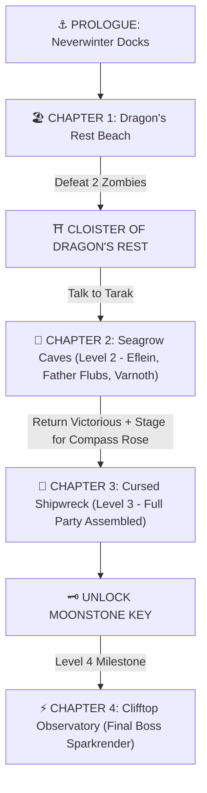

# 🛡️ Master DM Screen & Campaign Cheat Sheet - Dragons of Stormwreck Isle

> **Quick Glance Reference for the DM**  
> *All story arcs, encounter stats, NPC roleplay cues, items, and solo-balancing rules at a glance.*

---

## 🧙‍♂️ SECTION 0: PARTY CHARACTER SHEETS (LIVE SPECS — LEVEL 3 ACTIVE)

### ⚡ 1. Eflein (High Elf Wizard 3 — Evocation Arcana)
* **Concept & Archetype:** Sage Background | **Chaotic Neutral** | **Title:** **« Warden of the Living Grove »** | **Yankee / Delinquent Archetype** (Brash posture, sharp mouth, hands in pockets, fiercely pragmatic and protective).
* **Hit Points (HP):** **20 / 20** (Hit Dice: `3d6 + 6 CON` — Level 3 Upgraded) | **Armor Class (AC):** **12** *(15 with Mage Armor)* | **Speed:** 30 ft | **Passive Perception:** 13
* **Spellcasting Specs:** Base Spell Save DC **13** *(DC 14 for Lightning)* | Base Spell Attack Bonus **+5** *(+6 for Lightning via Awakened Scale)* | **1st-Level Slots:** **4 / 4** *(Arcane Recovery used)* | **2nd-Level Slots:** **2 / 2** | 👘 **Robe of Arcane Reserve:** `1/1` | 🤝 **Help Tokens:** `2 / 2`
* **Evocation Features:** 🔮 **Evocation Savant** | 💥 **Sculpt Spells** (Protects allies from AoE damage!)
* **Key Items:** 📜 **Lianna's Farewell Letter (The Archmage's Vow)**, 🥽 **Myla's Draconic Abyssal Goggles** (Darkvision 60ft & Murky Underwater Clarity), 🪄 **Wand of Magic Missiles (7 Charges)**, Astalagan's Awakened Amber Scale (+1 Focus/DC), Cracked Lodestone Bracelet (+1 Init, magnetic Mage Hand), Robe of Arcane Reserve (+1 Slot), Shortsword & Cutlass, Sling of the Ridge-Runner (+1), Scroll of Absorb Elements, Spore-Filter Rebreather Mask, 9 Potions of Healing, 5 Specialty Breads & Bagel (+2 AC), 28 gp 9 sp.

### 🐾 2. Sylvar Link (Half-Tabaxi Bard 3 — College of Whispers)
* **Concept & Archetype:** Entertainer Background | **Chaotic Good** | **Archetype:** **Blind Seismic Perceiver & Whispering Blade** (Charming femboy catboy, navigates the world through acoustic whiskers, floor vibrations, and tambourine rhythms like Toph; searching for his missing twin sister).
* **Hit Points (HP):** **27 / 27** (Hit Dice: `3d8 + 6 CON`) | **Armor Class (AC):** **15** (Leather + DEX +3 + 🛡️ Cloak of Protection) | **Speed:** 30 ft *(Feline Agility: 60 ft)* | **Initiative:** **+3** | **Passive Perception:** 13
* **Bardic Spellcasting Specs:** Spell Save DC **13** | Spell Attack Bonus **+5** | **1st-Level Spell Slots:** **4 / 4** | **2nd-Level Spell Slots:** **2 / 2** | **Bardic Inspiration:** `3 / 3` (d6) | 🤝 **Help Tokens:** `2 / 2`
* **College of Whispers Features:** 🧠 **Psychic Blades** (+2d6 Psychic damage on weapon hit, costs 1 Insp die), 👁️ **Words of Terror** (Seed paranoia in 1 min conversation, DC 13 Wis save or Frightened 1 hr).
* **Senses & Special Traits:** 🐾 **Blind Seismic Sense / Acoustic Blindsight (30–60 ft)** (Immune to visual dark/blind penalties; senses heartbeats, tremors, and footsteps), 🎶 **Song of Rest** (+1d6 HP on Short Rest), 🐾 **Feline Agility** (Burst to 60 ft speed).
* **Key Gear & Weapons:** 🛡️ **Cloak of Protection** (+1 AC / +1 Saves), 🗡️ **Rapier (+5 hit, 1d8+3 + 2d6 Psychic Blades)**, 🗡️ Steel Dagger 2x (+5 hit, 1d4+3), 🪘 Tambourine (Focus), 🎸 Lute & Guitar, 💣 2x Spitfire Flasks (2d4 Fire), 🧪 1x Potion of Healing, 🍞 Kobold Sweetbread Roll, 15 gp 0 sp.
* **Destiny Relic:** ❄️ **Clyssavar's Silver Harmonic Scale** (Trapped in Chapter 3 Compass Rose hold).

#### 🍷 3. Father Flubs — Level 3 Life Domain Cleric
* **Concept & Archetype:** Acolyte Background | **Neutral Good** | **Titles:** **« The Serpent Rider »** & **« Warden of the Living Grove »** | **Priest, War Veteran, Drunkard, Fire-Serpent Rider** (Keeper of Sharruth's volcanic secret; drinks and toasts to outrun the silence).
* **Hit Points (HP):** **24 / 24** (Hit Dice: `3d8 + 6 CON` — Level 3 Upgraded) | **Armor Class (AC):** **16** (Scale Mail + Shield) | **Speed:** 30 ft | **Passive Perception:** 13
* **Divine Magic Specs:** Spell Save DC **13** | Spell Attack Bonus **+5** | **1st-Level Spell Slots:** **3 / 4** | **2nd-Level Spell Slots:** **2 / 2** | 🤝 **Help Tokens:** `2 / 2`
* **Channel Divinity (1/Short Rest):** 🕊️ **Preserve Life** (Heals up to **15 HP** distributed to bloodied allies within 30 ft — Ready).
* **Passive Blessing:** 🌿 **Disciple of Life** (Healing spells heal extra `+2 + Spell Level` HP — *Healing Word* heals `1d4+6 HP`, *Cure Wounds* heals `1d8+6 HP` at 1st-lvl, `2d8+7 HP` at 2nd-lvl).
* **Domain & Prepared Spells:** *Bless*, *Cure Wounds*, **`Lesser Restoration`**, **`Spiritual Weapon`** (1d8+3 Force Bonus Action attack every turn!), **🐾 `Speak with Animals`** *(Innate Ritual/1st-Lvl Beast Communion)*, *Shield of Faith* (+2 AC), *Guiding Bolt* (4d6 Radiant), *Sanctuary* (DC 13 Wis).
* **🐍🏇 Giant Fire Snake Mount & Companion:** **"Thurible" (Large Elemental Mount • Level 3 Attuned • Official Mascot of Dragon's Rest)** (AC 14, HP 32 [scales +8 HP/lvl], Speed 30ft climb/swim, Living Hearth: **10ft Full Cold Damage Immunity Aura**, **🐍 Molten Bite +4 [1d6+2 + 1d6 fire]**, **💥 Molten Tail Whip +4 [1d4+2 + 1d6 fire, 10ft Push DC 13 Str]**, 🌊 Tail Constrict +4 [1d4+2 + 1d4 fire, Grapple/Restrain DC 13], Embers of Comfort 1d6+2 Temp HP). Flubs mounts Thurible for elevated vantage and terrain mobility.
* **Key Gear & Potions:** 🍾 **The Vintage of the Dawn Watch** (Sacred Jug & Holy Symbol), **13x Potions of Healing (Bonus: 2d6 / Action: Full Heal)**, **3x Elixirs of Health (Legendary: +20 Temp HP / 0 HP Full Revive)**, **2x Diluted Drake Blood Potions (+1 ATK, +2 DMG all day)**, Heavy Mace, Wooden Shield, Kobold Shield, Scale Mail, 52 gp 5 sp.

---

### 🛡️ 4. General Varnoth (Martial Defender 3 / Sidekick Tank) — Lead DM Controlled
* **Concept & Archetype:** Veteran Mercenary Commander (Azure Wolves) | **Lawful Good / Neutral** | **Titles:** **« Warden of the Living Grove »** & **« The Indomitable Iron-Oak »** | Battle-scarred frontline tank with peg leg.
* **Hit Points (HP):** **29 / 29** (Hit Dice: `3d8 + 6 CON` — Level 3 Upgraded) | **Armor Class (AC):** **17** (Splint Mail 15 + Shield +2) | **Speed:** 30 ft | **Passive Perception:** 14 | 🤝 **Help Tokens:** `1 / 2`
* **Martial Role Features:** 💥 **Improved Critical (Crits on 19 or 20!)**, ⚡ **Battle Readiness (Advantage on Initiative rolls)**.
* **Defensive Features & Actions:** 🛡️ *Protection Reaction* (Disadvantage on attacks vs adjacent ally), 💨 *Second Wind* (1d10+3 HP — Ready), ⚡ *Action Surge* (1 Extra Action per Short Rest — Ready), 🪓 *Shield Bash* (Athletics +4 vs Prone).
* **Equipment:** Splint Mail, Azure Wolf Steel Shield, Honed Longsword (+4 hit, 1d8+2/1d10+2, Crits on 19-20), Heavy Crossbow (+2 hit, 1d10), 🪓 Twin Notched Bone-Cleavers (Kobold Champion Trophy), 8 gp 6 sp.

### 📍 Complete Location & NPC Campaign Guide

#### ⛩️ CHAPTER 1: DRAGONSREST SETTLEMENT & SANCTUARY (LEVEL 1 HUB & RESURGENCE)
* **The Marble Stair Ascent (Settlement Entrance):** The primary path leading up into Dragonsrest from the shoreline below, consisting of ancient, weathered marble stairs carved directly into the seaside bluffs that open straight into the cloister. *(Encounter: 2 Drowned Sailors & Zombie Captain beach resurgence saving Blepp & Tarak).*
* **Dragon Plaza (Village Square):** The vibrant open-air center of Dragonsrest, dominated by a weathered bronze dragon monument on a stone plinth. It serves as the primary gathering ground where local kobolds and residents set up pop-up market stalls, trade trinkets, and share daily news under the gaze of the statue. *(Site of Thurible's legendary idol dance & sanctuary celebrations).*
* **Tarak's Herbal Area:** Set right along the edge of the ancient pool beneath the falls, where the constant mist and natural runoff nourish rare aquatic flora, mosses, and medicinal herbs used for brewing remedies.
* **Temple of Bahamut:** Perched atop the high northern cliffs overlooking the cloister, serving as a peaceful sanctuary and shrine dedicated to the Platinum Dragon. Elder Runara tends the altar. Faint protective aura grants **+1d4 to non-evil saving throws** inside temple.
* **Myla's Workshop:** A bustling smithy and artisan hub packed with forges, anvils, and racks of gear, providing weapons, repaired armor, and essential travel supplies.
* **Cafeteria & Tavern:** The social center built into the eastern terrace, featuring shared dining tables, food prep areas, and local brews for residents and travelers to unwind. *(Blepp & Frub specialty bakery).*
* **Quarters Area:** The residential quarters on the lower right terrace, offering communal rest spaces and private bunk rooms for the cloister’s inhabitants.
* **Gardens:** Sprawling, organized farm plots on the western plateau cultivated with edible crops, root vegetables, and daily staples to sustain Dragonsrest.
* **Cloister Quests & Hooks:**
  * *Tarak:* Sea Caves fungal blight (gives offering + 2 *Potions of Healing*).
  * *Varnoth & Rix:* Shipwreck investigation (*Compass Rose*).
  * *Runara:* Hands over **Moonstone Key** to Clifftop Observatory after proving worth.
* 🎭 **Chapter 1 Character Story Beats:**
  * 🧙‍♂️ **Eflein:** Follows wife Lianna's footprints; learns Runara & Kilnip spoke with her 8 months ago; unearths Astalagan's Bronze Scale and awakens it in the sacred spring.
  * 🍷 **Father Flubs:** Built his parish on the new land atop Sharruth's volcanic corpse to guard the secret; preaches god's mercy while drinking and joking past his dread of oblivion.

#### 🍄 CHAPTER 2: SEAGROW CAVES (LEVEL 2 DUNGEON & FUNGAL BLIGHT)
* **B0: Wilderness Spitfire Camp (Session 2 Intro Encounter):**
  * 🍖 **The Hostage:** Father Flubs (Level 2 Life Cleric) rescued from the kobold roasting spit!
  * 🦎 **The Enemies:** **5–6 Kobold Ambushers** + **1 Kobold Cleaver Champion** (Defeated & Cleared!).
* **B1: Entrance Tunnel:** **Boss:** Spore Servant Octopus (AC 12, HP 58-65). Flooded at high tide; low tide exposes stone column walkways. Father Flubs awakens as sea mist hits his face!
* **B2: Fungus Farm:** **Encounter:** 2-3 Violet Fungi (26-30 HP). **NPCs:** Sprouts Molen & Kraz, Adults Hipsiz & Rugoso. **Loot:** Heart Cap Mushrooms (Tarak brews into *Potions of Healing*). Lianna's geothermal notes found in upper alcove!
* **B3: Larder:** **Encounter:** 6 Stirges emerge from ceiling nest. Sprouts Bispo, Valup, & Popple flee to B4.
* **B4: Circle Chamber & B5: Sinensa's Sanctum:** 6 Myconid Adults in meld trance. **Sinensa (unconscious Myconid Leader)** tended by Auranta & Enok. **Loot:** Ruby Morel (Tarak brews into *Elixir of Health*).
* **B6: Crystal Cave (Blight Source & Geothermal Core):** **Encounter:** 2 Fume Drakes (28-32 HP) + Fire Snake (30-35 HP). Shatter orange fire crystal blocking fissure ➔ vents volcanic Sharruth gases & floods cave with sunlight ➔ cures Sinensa & Myconids! 
  * **Loot:** 25 obsidian chunks (10 gp each = 250 gp).
  * **Level 3 Milestone:** Completing Seagrow Caves elevates the party to **Level 3**!
* 🎭 **Chapter 2 Character Story Beats:**
  * 🧙‍♂️ **Eflein:** Discovers Lianna's discarded botanical margin notes on Sharruth's geothermal crystal vents, learning how the fungal blight is connected to Sharruth's stirrings, and uses arcane precision to shatter the crystal safely.
  * 🍷 **Father Flubs:** Awakens at B1; recognizes Sharruth's volcanic breathing pulsing in B6 crystals, sparking war memories of the dragon's fall; channels *Preserve Life*, *Bless*, and healing miracles to keep his comrades alive and stabilize Sinensa!
  * 🛡️ **Varnoth:** Commands frontline tactics, shielding Eflein from Fume Drake breath attacks.

#### 🚢 CHAPTER 3: CURSED SHIPWRECK — COMPASS ROSE (LEVEL 3–4 DUNGEON & REEF)
* **The Dramatic Chapter Transition Hook at Dragon's Rest:**
  * Eflein, Father Flubs, and Varnoth return victorious to Dragon's Rest and receive rewards from Runara and Tarak.
  * The party prepares for their next journey as they learn that Clyssavar's Silver Scale is trapped inside the *Compass Rose* and dark undead forces are attempting to corrupt it. The cloister elders explain the rising danger: the sea itself has been poisoned by dark death magic ever since young Aleitha attempted a forbidden resurrection ritual to revive her drowned husband Brastos, cursing the reef with drowned zombies and transforming herself into **Aleitha, The Drowned Queen (Zombie Queen)**!
* **C1: Main Deck & Quarterdeck (The Throne of the Drowned Queen):** **Boss:** **Aleitha, The Drowned Queen** (CR 2 Boss, AC 13, HP 55–65, Swim 30ft, Claws +5 [1d6+3+1d6 necro], Brine Bolt +5 [2d6+3 necro], Aura of the Drowned [1d4 necro 10ft aura], Sorrowful Dirge [DC 13 Wis Save or 2d8 psychic + Frightened]).
* **C4: Captain's Quarters:** **Encounter:** 2 Drowned Zombies (28–32 HP) + Zombie Captain (48–55 HP, AC 11). Door barricaded (DC 10 Str). Defeating the room lets Eflein search the desk to find the *Compass Rose* Passenger Manifest signed by **Lianna** and **Lianna's Field Journal Note** (detailing Clyssavar's wind/thunder harmonics in hold C9, her vanguard Lyra holding the deck against swarming dead/harpies, and the star-math clue pointing to the Observatory!). **Loot:** Desk compass (25 gp), cartographer's tools, 50 gp.
* **C6: Crew Quarters:** Portrait of "Aleitha & Brastos — Together Forever". Trap floorboard ➔ dart (+5 hit, 1d4 + DC 11 Con save 1d6 poison). **Loot:** 200 gp in floor stash.
* **C8: Lower Deck & Frost Cabin:** **Encounter:** 1 Zombie + 1 Ghoul lurking in knee-deep sloshing water (Paralyzing Claws DC 10). Inside a hidden iron lockbox, the party uncovers ancient Draconic records detailing the Tri-Draconic Convergence.
* **C9: Submerged Hold (The Sunken Vault):** Submerged hold where the Captain's Chest lies. Opened with Aleitha's Ivory Key, containing 🌪️ **Scale of the Zephyr (Clyssavar's Silver Scale)** (+1 Spell Atk/DC, Immune to Deafened, Thunder Resist, +1d6 Gale-Burst with 10ft Push & Disadv 1/day, Whispers on the Wind — claimed and awakened by Sylvar Link), the Captain's Logbook, *Boots of Elvenkind*, and 55 gp.
  * **Side Quest Resolution:** Carry Aleitha's Braided Talisman to **Brastos's grave** in Dragon's Rest clifftop cemetery. Burying or burning it reunites their souls in peace, permanently lifting the island's zombie curse and causing the ghost shipwreck to dissolve peacefully into sea foam!
  * **Level 4 Milestone:** Party reaches **Level 4** (Feats / Ability Score Improvements, +HP pools, and expanded spell slots unlocked!).
* 🎭 **Chapter 3 Character Story Beats:**
  * 🧙‍♂️ **Eflein:** Discovers Lianna's handwritten note and passenger signature; uses lightning arc spells across the flooded decks with *Sculpt Spells* to electrocute zombies without shocking allies!
  * 🐾 **Sylvar Link:** Discovers twin-crescent blade gouges in the main mast and Lyra's torn crimson sash; braves the submerged hold (C9) to bond with **Clyssavar's Silver Scale**, experiencing the acoustic epiphany of the Zephyr Awakening and unlocking Level 4!
  * 🍷 **Father Flubs:** Deeply moved by Aleitha and Brastos's tragic love and his own existential fear of oblivion; performs sacred funeral rites for the drowned sailors, cleanses Aleitha's talisman at Brastos's grave, and redeems the fallen queen.

#### ⚡ CHAPTER 4: CLIFFTOP OBSERVATORY (LEVEL 4–5 CAMPAIGN CLIMAX & APEX BOSS)
* **D1: Overlook:** 2 Dragon Statues with moonstone key slots. Inserting key creates shimmering energy bridge across to D2! Trail shows severed Fume Drake bones cleanly cleaved by Lyra's twin blades.
* **D2: Rotunda Ruins:** **Encounter:** 2 Winged Kobolds (Mek & Minn) fighting 8 Stirges. Central astronomical planet model & 5 Dragon Effigies (Astalagan, Clyssavar, Eldenemir, Sharruth, Turadaer).
* **D3: Kobold Camp & D4: Study:** 5 Kobolds + 1 Kobold Champion (32–38 HP, AC 15). Black Journal with explosive rune trap (2d10 force). Clue: *"Point your eyes toward the Dragon's light"*. **Loot:** Potion of Lightning Resistance + 10 gp.
* **D5: Observatory Tower & Secret Planetarium Vault:** 
  * 🧩 **Scholar Statue Constellation Puzzle:** Sylvar senses the floor vibrations and weight balance of the 4 Scholar Statues while Eflein uses Lianna's math to rotate them toward the Dragon of Dawn constellation ➔ floor lowers forming spiral staircase to D6 & opens secret vault!
  * ☀️ **Turadaer's Gold Scale:** Resting inside the secret planetarium vault!
* **D6: Secret Vault & Apex Ritual Battle:**
  * **Sparkrender's Grand Motive (The Siphon of Sharruth):** Sparkrender is hunting all three ancient metallic dragon scales (Bronze, Silver, Gold). He plans to use the **King-Killer Star** comet passing overhead to violently shatter the 3-scale seal on Sharruth's undersea magma tomb and **siphon the sleeping Red Dragon's god-like primordial flame into his own body**, ascending into a catastrophic **Volcanic Thunder-Dragon**!
  * **NPC Ally:** Aidron (Bronze Wyrmling, 42–48 HP, AC 17) bound with 3 chains for Sparkrender's ritual. Freeing Aidron mid-fight grants Repulsion Breath (DC 12 Str) to push Sparkrender out of flight!
  * **Boss:** **Sparkrender (Apex Blue Wyrmling)** (CR 4 Apex Boss, AC 15, 95–110 HP, Fly 60ft, Multiattack Bite +5 [1d10+3 pierc + 1d6 lightn] / Claw +5 [1d6+3 slash], Lightning Breath [4d10 lightning, DC 13 Dex save for half]).
  * ⚡ **The Grand Climax — The Tri-Draconic Convergence:** Party activates the Tri-Draconic Convergence (Bronze Lightning, Silver Zephyr Thunder, Gold Solar Radiant), permanently sealing Sharruth's tomb. Eflein and Sylvar read **Lianna's final letter** on the Draconic World Atlas confirming Lianna and Lyra chartered a ship to the lost Ancient Dragon Lands! Party reaches **Level 5 Milestone (3rd-Level Spells, 2-Beam Cantrips & Master Tier)**.

---

### 🎭 SECTION 1.4: INDIVIDUAL HERO DESTINY QUESTS & DEEP PERSONAL ARCS

#### 🧙‍♂️ 1. Eflein's Destiny Arc: In Lianna's Footsteps (The Delinquent Prodigy & The Ancient Dragon Lands)
* **Hero:** Eflein (High Elf Evocation Wizard 2/3) | **Archetype:** Delinquent / Yankee Prodigy
* **Core Motivation:** Discover why his brilliant wife Lianna journeyed to Stormwreck Isle 8 months ago, decode the ancient draconic secrets she unraveled, and follow her trail to the next realm.
* **Chapter Objectives & Investigation Trail:**
  1. 📖 **Dragon's Rest Library (A4):** Speak with insomniac kobold Kilnip. Kilnip returns Lianna's dragon-bone bookmark and her annotated copy of *The Secret Fires of Sharruth*, detailing the 3 Metallic Dragon Scales and Sharruth's volcanic seal.
  2. 🍄 **Seagrow Crystal Conduits (B6):** Discover Lianna's discarded botanical margin notes explaining how Sharruth's geothermal magma veins supercharge fungal spores; learns how to safely vent toxic brimstone.
  3. 🚢 **Shipwreck Passenger Logbook & Note (C4):** Recover the *Compass Rose* manifest and Lianna's field note detailing Clyssavar's wind/thunder harmonics and Lyra holding the deck.
  4. 🔭 **Observatory Planetarium (D4-D5):** Use Lianna's stellar math notes to disarm the explosive rune trap and align the 4 Scholar Statues to the Dragon of Dawn constellation without triggering magical alarms.
  5. ⚡ **Astalagan's Resonance & Volcano Stabilization:** Channel Astalagan's bronze scale into the Tri-Draconic Convergence, shutting down Sparkrender's comet siphon and securing the island!
  6. 📜 **The Climax Revelation & Lianna's Final Letter:** After Sparkrender is defeated, Eflein accesses the **Ancient Draconic World Atlas** carved into the observatory floor. On a stone plinth, he finds Lianna's final letter left specifically for him (with the P.S. about Lyra pacing the docks).
* **Rewards & Milestones:** ⚡ **Astalagan's Awakened Amber Scale** (+1 Spell Attack & DC, +1d6 Lightning damage surge 1/turn), +2 to Arcana checks permanently, Lianna's Star-Atlas Coordinates to the Ancient Dragon Realm (Next Campaign Hook!), and Level 5 Evocation Mastery.
* **Branching DM Scenarios:**
  * *Scenario A (The Voyage to the Dragon Lands):* Eflein rallies Sylvar, Flubs, and Varnoth to chart a vessel and set sail for the mysterious ancient dragon kingdom, seamlessly kicking off the party's next high-level campaign!
  * *Scenario B (The Cloister Archive):* Eflein copies the observatory's master celestial star charts into his own spellbook, earning Elder Runara's title of *Master Arcanist of the Dragon Spire*.

#### 🐾 2. Sylvar Link's Destiny Arc: The Path of Acoustic Enlightenment & The Sister's Vanguard
* **Hero:** Sylvar Link (Half-Tabaxi Whispers Bard 3) | **Archetype:** Blind Seismic Perceiver / Whispering Blade / Seeking Sister
* **Core Motivation:** Trace the footsteps of his twin sister Lyra (Chosen Warrior of the Lush Peaks Clan), transcend the perceived limits of his blindness through acoustic draconic harmony, and reclaim his family's bond.
* **Chapter Objectives & Awakening Trail:**
* **Chapter Objectives & Sacred Rites:**
  1. ⛺ **The Spitfire Rescue & Seagrow Expedition (B0–B6):** Freed from the roasting spit; awakens at the basalt cave entrance (B1). When he senses Sharruth's geothermal breathing pulsing in the B6 crystals, he unleashes *Preserve Life*, *Bless*, and healing miracles to ensure no ally falls.
  2. 🪦 **The Forgotten Dead of the Compass Rose (Ch 3):** Deeply moved by the forgotten drowned sailors, Father Flubs performs solemn funeral rites. He cleanses Aleitha's Orcus talisman upon Captain Brastos's grave at Dragon's Rest cemetery, dissolving the shipwreck and granting eternal rest.
  3. ☀️ **Attuning to Turadaer's Gold Scale (Ch 4 - D5):** Discovers and attunes to ☀️ **Turadaer's Solar Gold Scale** in the secret planetarium vault.
  4. 🛡️ **The Golden Aegis & Tri-Draconic Convergence:** Standing on the dragon's grave his ancestors swore to protect, Flubs channels the Gold Scale into the Tri-Draconic Convergence, creating an impenetrable 20-ft divine radiant barrier that neutralizes Sparkrender's catastrophic lightning breath!
  5. 🍷 **The Toast of Permanence:** Celebrates with his companions atop the observatory, realizing that his life, his lineage, and the memory of those he saved are truly eternal.
* **Rewards & Milestones:** ☀️ **Turadaer's Gold Scale** (+1 AC/Saves, Radiant Bastion 10ft aura: grants +1d4 to all ally saves, Beacon of Dawn heal), Keeper of the Dragon's Grave Title, and Level 5 Master Tier.
#### 🍷 3. Father Flubs' Destiny Arc: The Ward-Priest's Secret & Turadaer's Dawn
* **Hero:** Father Flubs (Human Life Domain Cleric 2) | **Archetype:** Priest, Ward-Healer Bloodline, Drunkard, Keeper of an Ancestral Secret
* **Core Motivation:** Guard the secret of Sharruth's volcanic tomb decreed centuries ago by the three ancient dragons to his ancestral order, keep his companions alive through miraculous healing, and outrun the fear of oblivion through toasts, jokes, and sacred vigils for the forgotten dead.
* **Chapter Objectives & Sacred Rites:**
  1. ⛺ **The Spitfire Rescue & Seagrow Expedition (B0–B6):** Freed from the roasting spit; awakens at the basalt cave entrance (B1). When he senses Sharruth's geothermal breathing pulsing in the B6 crystals, he unleashes *Preserve Life*, *Bless*, and healing miracles to ensure no ally falls.
  2. 🪦 **The Forgotten Dead of the Compass Rose (Ch 3):** Deeply moved by the forgotten drowned sailors, Father Flubs performs solemn funeral rites. He cleanses Aleitha's Orcus talisman upon Captain Brastos's grave at Dragon's Rest cemetery, dissolving the shipwreck and granting eternal rest.
  3. ☀️ **Attuning to Turadaer's Gold Scale (Ch 4 - D5):** Discovers and attunes to ☀️ **Turadaer's Solar Gold Scale** in the secret planetarium vault.
  4. 🛡️ **The Golden Aegis & Tri-Draconic Convergence:** Standing on the dragon's grave his ancestors swore to protect, Flubs channels the Gold Scale into the Tri-Draconic Convergence, creating an impenetrable 20-ft divine radiant barrier that neutralizes Sparkrender's catastrophic lightning breath!
  5. 🍷 **The Toast of Permanence:** Celebrates with his companions atop the observatory, realizing that his life, his lineage, and the memory of those he saved are truly eternal.
* **Rewards & Milestones:** ☀️ **Turadaer's Gold Scale** (+1 AC/Saves, Radiant Bastion 10ft aura: grants +1d4 to all ally saves, Beacon of Dawn heal), Keeper of the Dragon's Grave Title, and Level 5 Master Tier.

---

#### 🌲 SECTION 1.5: ISLAND WILDERNESS & MINOR ENCOUNTERS
* **♨️ Geothermal Hot Springs (Site of Brass Dragon's Death):**
  * **Atmosphere & Features:** Turquoise luminescent bubbling pool surrounded by rainbow wind spore mushrooms.
  * **Restorative Waters:** Bathing for 10 minutes allows a character to roll 1 Hit Die and regain HP equal to the roll + CON modifier (1/day).
  * **Encounter:** 3 mischievous **Fume Drakes** (CR 1/4) attack if mushrooms are harvested.
  * **Treasure:** `2d4` **Wind Spores** (DC 15 Nature check; squeeze cap to not need breathing/oxygen for 1 hour, worth 30 gp each).
* **🦉🐻 Screeching Owlbear Grove & Coastal Cave:**
  * **Atmosphere:** Thick ravine of purple briars and basalt boulders.
  * **Encounter:** 1 **Apex Owlbear** (CR 3, 58–65 HP, AC 13).
  * **Whistle Taming Mechanic:** The owlbear was a circus beast stranded here. An adventurer within 5 ft can use an Action to grab the brass whistle around its neck (DC 12 STR check) and blow it (DC 10 Animal Handling) to calm the beast into a friendly ally!
  * **Treasure:** Thick Owlbear Pelt (25 gp), Razor Talons, *Ring of Resistance* (Rare).
* **🦎 Renegade Kobold Ambush Trails:**
  * **Encounter:** 4–8 **Kobold Renegades** + 1–2 **Winged Urds** who rejected both Runara's pacifism and Sparkrender's tyranny.
  * **Tactics:** Stealth check (+2) vs party passive Perception. Desperate and can be bribed with 5 gp or rations to stand down.
* **🧜‍♀️ Sea Hag's Cove & Drowned Witch Grotto:**
  * **Atmosphere:** Fog-drenched sea cave lined with bone totems and decaying kelp.
  * **Encounter:** 1 **Sea Hag / Cove Witch** (CR 2, 48–55 HP, AC 14).
  * **Tactics:** *Horrific Appearance* (DC 11 WIS Save) followed by *Death Glare* (0 HP on fail!).
  * **Treasure:** 🍷 *Elixir of Health*, Black Pearl (30 gp), Cursed Bone Charm.
#### 💎 SECTION 1.6: SIDE QUESTS, RELIC HUNTS & REGIONAL BOUNTIES
* 💔👑 **The Tragic Love of Aleitha & Brastos (The Zombie Queen's Redemption):**
  * **Background:** Sailor Brastos drowned on the reefs years ago and was buried at Dragon's Rest. His grieving wife Aleitha sailed to the island with a dark death-magic talisman to perform a forbidden resurrection ritual. When the *Compass Rose* wrecked, the dark ritual ruptured—saturating the sea with necrotic mana, turning dead sailors into drowned zombies, and transforming Aleitha into **The Drowned Queen (Zombie Queen)**.
  * **Objective:** Defeat Aleitha aboard the *Compass Rose* to reclaim her glowing **Braided Hair-Talisman** (and unlock the submerged hold with the Ivory Key for Clyssavar's Silver Scale).
  * **Cleansing Ritual:** Bring Aleitha's talisman to **Brastos's grave** in the wildflower clifftop cemetery at Dragon's Rest. Burying or burning the talisman reunites their souls in peace.
  * **Reward:** Permanently cleanses the island of drowned zombies, dissolves the ghost shipwreck into sea foam, grants **+1 to All Saving Throws for 24 hours** (Bahamut & Eldath's Blessing), and awards 200 gp.
* 🍄 **The Ruby Morel Harvest & Elixir of Health (Seagrow Caves B5):**
  * **Objective:** Harvest the rare crimson mushroom under Sovereign Sinensa's throne (DC 12 Nature/Sleight of Hand).
  * **Reward:** Tarak distills it into 🍷 **Elixir of Health** (cures any disease/blindness/paralysis/poison) + 2 Potions of Healing.
* ♨️ **Geothermal Hot Springs Fumarole Cleansing (Island Wilderness):**
  * **Objective:** Clear out nesting Fume Drakes and unblock brass dragon hot springs.
  * **Reward:** Bathing grants **+10 Temporary HP & Advantage on CON Saves** for 8 hours.
* 🦉🐻 **Taming the Screeching Owlbear (Wilderness Ridge Grove):**
  * **Objective:** Slay or tame territorial apex owlbear using brass whistle (DC 12 STR to grab / DC 10 Animal Handling).
  * **Reward:** **Azure Wolf Heavy Cloak**, 45 gp, and Owlbear Feather Focus (+1 Nature/Survival).
* 🥐 **Sanctuary Specialty Bread Bart## 🎭 SECTION 2: MASTER NPC & ALLY DIRECTORY (WITH PHILOSOPHY & LIVE DILEMMAS)

### 📊 Master Campaign NPC Fast Reference Table (Divided by Faction & Met Status)

| Region / Faction | NPC Name & Title | Status / World State | AC | HP | INIT | Speed | 🧭 Core Philosophy & ⚡ Immediate Problem | 🗣️ Voice & Roleplay Cue |
| :--- | :--- | :--- | :--- | :--- | :--- | :--- | :--- | :--- |
| **🛡️ Party Companions** | 🛡️ **General Varnoth** | `⭐ MET & ACTIVE` | 17 | 29 | **+0★** | 30 ft | **🧭 Pragmatic Redemptive Duty:** Peace requires iron vigilance. ⚡ *Peg leg rot & guilt over failing to sprint to the reef in time.* | Low, raspy battlefield authority. *"Keep your head down, kid. Check your corners."* |
| | 🐍🔥 **Thurible** | `⭐ ACTIVE MASCOT` | 14 | 32 | **+2** | 30 ft | **🧭 Primal Warmth & Pack Loyalty:** Heat is love, cold is agony. ⚡ *Morning ocean fog makes tail stiff; wants to sleep in baking oven.* | Deep rhythmic boiler-purrs, gentle hiss of steam, sweetbread puppy-tilts. |
| | ❄️ **Vaelith Frostborne** | `⭐ MET & ACTIVE` | 16 | 24 | **+2** | 30 ft | **🧭 Sovereign Solitude & Cold Pragmatism:** Rely only on bloodline frost. ⚡ *Bruised ribs from solo reef run; Silver Scale frequency buzzing in ears.* | Whispering, cold, measured tone like cracking ice. *"The storm doesn't negotiate."* |
| **⛩️ Dragon's Rest** | 🐉 **Elder Runara** | `⭐ MET & ACTIVE` | 19 | 212 | **+0** | Fly 80 | **🧭 Restorative Pacifism:** Cycles of draconic blood-feuds must end. ⚡ *Apprentice Aidron rejected peace and stormed off to Sparkrender's spire.* | Serene, gentle, maternal ancient wisdom. *"May Bahamut guide your peace."* |
| | 🌿 **Tarak** | `⭐ MET & ACTIVE` | 13 | 27 | **+3** | 30 ft | **🧭 Penitent Quietism:** Past sins atoned by nurturing life and healing. ⚡ *Myconids placed octopus guardian; Heart Cap mushroom supply cut off.* | Former assassin atoning. Calm, dry, quiet. *"The soil doesn't judge yesterday."* |
| | 🛠️ **Myla "Goggles"** | `⭐ MET & ACTIVE` | 12 | 10 | **+2** | Fly 30 | **🧭 Technological Optimism:** Ingenuity conquers physical trauma. ⚡ *Twin brothers abandoned her and joined Sparkrender; hopes to save them.* | Chirpy, hyperactive squeaks. *"Cast a spark and I'll knock off 10%!"* |
| | 📋 **Agga** | `🕊️ Sanctuary Citizen` | 12 | 8 | **+1** | 30 ft | **🧭 Stoic Utilitarian Order:** Tranquility exists through strict supply tallies. ⚡ *Pantry salt caked by ocean fog; youngsters slacking on sweeping.* | Brisk, dry, no-nonsense supervisor. *"If you have time to lean, grab a broom."* |
| | 🦎 **Blepp & Frub** | `⭐ MET & ACTIVE` | 12 | 7 | **+2** | 30 ft | **🧭 Animistic Fatalism & Curiosity:** Luck charms and hot bread ward off evil. ⚡ *Sourdough starter cold; nearly bitten by beach zombies yesterday.* | Superstitious baker, high squeaks. *"My dagger blocked a dragon's sneeze!"* |
| | 📚 **Kilnip** | `🕊️ Sanctuary Citizen` | 11 | 7 | **+1** | 30 ft | **🧭 Archival Preservationism:** Written truth immortalizes the soul. ⚡ *Mildew creeping onto Lianna's ancient star charts; needs blotting sand.* | Sleepy, sweet insomniac reader. *"Lianna had the kindest handwriting."* |
| | ⚙️ **Laylee** | `🕊️ Sanctuary Citizen` | 12 | 8 | **+2** | Fly 30 | **🧭 Empirical Tinkerism:** You learn by building and blowing things up. ⚡ *Banned from forge after singeing kitchen; sneaking parts for grapple claw.* | Wide-eyed, energetic squeaks with soot on snout. *"It reorganized very loudly!"* |
| | 🪙 **Mumpo** | `🕊️ Sanctuary Citizen` | 12 | 8 | **+2** | 30 ft | **🧭 Audacious Bravado:** Greatness belongs to bold tricksters. ⚡ *Terrified of losing the dragon scale he 'stole' from Runara's temple.* | Cocky theatrical stage-whispers. *"You're looking at a master thief!"* |
| | 🕊️ **Rix** | `🕊️ Sanctuary Citizen` | 12 | 9 | **+1** | 30 ft | **🧭 Devotional Levity:** Humor and prayer keep darkness from poisoning souls. ⚡ *Incense brazier cracked in gale; heard singing voice lure ship to reef.* | Pious, cheerful acolyte. *"Why do dragons sleep on gold? Sweet dreams!"* |
| | 🗡️ **Zark** | `🕊️ Sanctuary Citizen` | 13 | 10 | **+2** | 30 ft | **🧭 Aggressive Fortress Defense:** Peace without spears is an open banquet. ⚡ *Seagulls stealing fish bait; paranoid of pirate raiders in sea mist.* | Fierce, snappy cliff barking. *"Halt right there, gas-spore face! State business!"* |
| **🍄 Seagrow Caves** | 🍄 **Spore-Tender Pips** | `🍄 Cave Guide` | 10 | 7 | **+0** | 20 ft | **🧭 Innocent Telepathic Connection:** Minds that touch cannot hate. ⚡ *Sulfur fumes drying sprout nursery; octopus guardian won't let him out.* | Silent; telepathic petrichor, lavender smells, and gentle sensory pulses. |
| | 🍄 **Sovereign Sinensa** | `⏳ UNMET / COMATOSE` | 13 | 60 | **+0** | 20 ft | **🧭 Mycelial Harmony:** All living things are interconnected threads. ⚡ *Comatose from B6 volcanic sulfur fumes; nursery rotting without care.* | Deep harmonic telepathic resonance. *« The roots weep burning sulfur... »* |
| **⚡ Clifftop Observatory** | 🐉 **Aidron** | `⏳ RESCUE TARGET (D6)` | 17 | 32 | **+0** | Fly 60 | **🧭 Militant Righteousness:** Evil must be actively crushed in battle. ⚡ *Bound in iron chains in D6; terrified of Sparkrender's comet sacrifice.* | Proud, hot-headed young bronze dragon. *"Undo these chains and watch me fly!"* |
| | 🦇 **Mek & Minn** | `⏳ PRISONERS (D2)` | 13 | 14 | **+3** | Fly 30 | **🧭 Survivalist Cowardice:** Cling to whoever has the biggest fangs. ⚡ *Trapped by 8 stirges while painting effigies; eager to trade secrets.* | Terrified, high-pitched squawks pleading for rescue from stirges. |

---

## ⚔️ SECTION 3: MONSTER STAT BLOCKS & BIOME ENEMY DIRECTORY (WITH PHILOSOPHY & MORALS)

### 📊 Master Enemy Fast Reference & Combat Modifiers Table (Divided by Biome)

| Region / Biome | Enemy Name & Encounter Role | CR | INIT | HP | AC | Speed | STR | DEX | CON | INT | WIS | CHA | Main Attack (+Hit, Range, Dmg) | Save DC / Special Ability |
| :--- | :--- | :--- | :--- | :--- | :--- | :--- | :--- | :--- | :--- | :--- | :--- | :--- | :--- | :--- | :--- |
| **🏖️ Dragon's Rest & Beach** | 🧟 **Zombie Captain** *(🏆 BEACH RESURGENCE BOSS)* | 1 | **-1** | 38-42 | 10 | 25 ft | **+2** | **-1** | **+3** | **-2** | **+2★** | **-1** | Cutlass **+4** (1d6+2 slash) + Slam **+4** (1d6+2) | Undead Fortitude (DC 5+dmg Con) |
| | 🧟 **Drowned Sailor (Zombie)** *(Beach Ambush)* | 1/4 | **-2** | 28-32 | 9 | 20 ft | **+1** | **-2** | **+3** | **-4** | **+0★** | **-3** | Slam **+3** (1d6+2 bludgeon) | Undead Fortitude (DC 5+dmg Con) |
| **🍄 Seagrow Caves** | 🐍 **Fire Snake & Fume Drakes** *(🏆 B6 CORE CLIMAX BOSS)* | 1 | **+2** | 30-35 | 14 | 30 ft | **+1** | **+2** | **+0** | **-4** | **+0** | **-1** | Bite **+4** (1d4+2 + 1d6 fire) | Heated Body: 1d6 fire on contact |
| | 🐙 **Spore Octopus** *(B1 Entrance Guardian)* | 1 | **+2** | 58-65 | 12 | Swim 50 | **+3** | **+2** | **+2** | **-4** | **+0** | **-5** | Tentacle **+5** (1d8+3 + Grapple DC 13) | Spore Cloud: DC 12 Con (2d6 poison) |
| | 💨 **Fume Drake** *(B6 Fissure Minion)* | 1/4 | **+2** | 28-32 | 12 | Fly 30 | **+0** | **+2** | **+1** | **-3** | **+0** | **-2** | Bite **+4** (1d6+2 + 1d4 fire) | Breath: DC 11 Con (2d6 psn/fire) \| Death Burst |
| | 🌿 **Violet Fungus** *(B2 Farm Hazard)* | 1/4 | **-5** | 26-30 | 6 | 5 ft | **-4** | **-5** | **+1** | **-5** | **-4** | **-5** | Rotting Touch **+2** (1d8 necrotic, 10ft) | False Appearance (Looks like mushroom) |
| | 🦟 **Stirges** *(B3 Larder Swarm)* | 1/8 | **+3** | 8-12 | 14 | Fly 40 | **-3** | **+3** | **+0** | **-4** | **-1** | **-2** | Proboscis **+5** (1d4+3 pierc + Attach) | Blood Drain: 1d4+3 auto dmg each turn |
| **🚢 Compass Rose Shipwreck (Lvl 3–4)** | 👑 **Aleitha, The Drowned Queen** *(🏆 SHIPWRECK ZOMBIE QUEEN BOSS)* | 2 | **+2** | 55-65 | 13 | 30 ft, Swim 30 | **+2** | **+2** | **+3** | **+1** | **+2** | **+3** | Claws **+5** (1d6+2 slash + 1d6 necro) / Brine Bolt **+5** (2d6+3 necro) | Aura of Drowned (1d4 necro 10ft) \| Dirge: DC 13 Wis (2d8 psych + Fear) |
| | 🧟 **Zombie Captain** *(🏆 C4 CABIN ELITE MINION)* | 1 | **-1** | 48-55 | 11 | 25 ft | **+2** | **-1** | **+3** | **-2** | **+2★** | **-1** | Cutlass **+4** (1d6+2 slash) + Slam **+4** (1d6+2) | Undead Fortitude (DC 5+dmg Con) |
| | 🧟 **Drowned Sailor (Zombie)** *(C4 Cabin & C8 Hold)* | 1/4 | **-2** | 28-32 | 9 | 20 ft | **+1** | **-2** | **+3** | **-4** | **+0★** | **-3** | Slam **+3** (1d6+2 bludgeon) | Undead Fortitude (DC 5+dmg Con) |
| | 💀 **Skeleton Sailor** *(C2 Forecastle Patrol)* | 1/4 | **+2** | 20-24 | 13 | 30 ft | **+0** | **+2** | **+2** | **-2** | **-1** | **-3** | Scimitar **+4** (1d6+2 slash) / Bow **+4** (1d6+2) | Vulnerable Bludgeoning |
| **⚡ Clifftop Observatory (Lvl 4–5)** | 🐉 **Sparkrender** *(👑 CAMPAIGN APEX FINAL BOSS)* | 4 | **+2** | 95-110 | 15 | Fly 60 | **+3** | **+2★** | **+4★** | **+1** | **+2★** | **+3★** | Bite **+5** (1d10+3 pierc + 1d6 light) + Claw **+5** (1d6+3) | Breath: 30ft line, DC 13 Dex (4d10 light, half on save) |
| | 🛡️ **Kobold Champion** *(🏆 D3 CAMP COMMANDER)* | 1/2 | **+2** | 32-38 | 15 | 25 ft | **+1** | **+2** | **+2** | **-1** | **+0** | **+0** | Spear/Cleavers **+4** (1d6+2) | Shield Bash: DC 12 Str Save or Prone |
| | 🦇 **Winged Kobold (Urd)** *(D2 & D3 Aerial Guard)* | 1/4 | **+3** | 18-22 | 13 | Fly 30 | **-2** | **+3** | **+0** | **-1** | **-1** | **-1** | Dropped Bomb **+5** (1d6+3 bludgeon/fire) | Pack Tactics (Aerial Bomber) |
| | 🦎 **Kobold Ambusher** *(D3 Tower Guard)* | 1/8 | **+2** | 14-18 | 13 | 30 ft | **-2** | **+2** | **+1** | **-1** | **-1** | **-1** | Dagger **+4** (1d4+2) / Sling **+4** (1d4+2+1 fire) | Pack Tactics (Advantage near ally) |
| | 🦟 **Stirges** *(D2 Rotunda Battle)* | 1/8 | **+3** | 8-12 | 14 | Fly 40 | **-3** | **+3** | **+0** | **-4** | **-1** | **-2** | Proboscis **+5** (1d4+3 pierc + Attach) | Blood Drain: 1d4+3 auto dmg each turn |
| **🌲 Island Wilderness & Grottos** | 🦉🐻 **Apex Owlbear** *(🏆 WILDERNESS APEX CR 3)* | 3 | **+1** | 58-65 | 13 | 40 ft | **+5** | **+1** | **+3** | **-4** | **+1** | **-2** | Beak **+7** (1d10+5) + Claw **+7** (2d8+5) | Keen Sight & Smell (Perception +3) |
| | 🧜‍♀️ **Sea Hag / Cove Witch** *(🏆 GROTTO BOSS CR 2)* | 2 | **+1** | 48-55 | 14 | Swim 40 | **+3** | **+1** | **+3** | **+1** | **+1** | **+1** | Claws **+5** (2d6+3 slash) | Horrific Appearance (DC 11) / Death Glare (0 HP!) |
| | 🛡️ **Kobold Cleaver Champion** *(🏆 SPITFIRE / RIDGE CAMP BOSS)* | 1/2 | **+2** | 28-34 | 15 | 25 ft | **+1** | **+2** | **+2** | **-1** | **+0** | **+0** | Spear/Cleavers **+4** (1d6+2) | Shield Bash: DC 12 Str Save or Prone |
| | 🦎 **Kobold Ambushers** *(Wilderness Ridge Trails & B0 Camp)* | 1/8 | **+2** | 14-18 | 13 | 30 ft | **-2** | **+2** | **+1** | **-1** | **-1** | **-1** | Dagger **+4** (1d4+2) / Sling **+4** (1d4+2+1 fire) | Pack Tactics (Advantage near ally) |
| | 🦇 **Winged Kobold (Urd)** *(Wilderness Ambush Scout)* | 1/4 | **+3** | 18-22 | 13 | Fly 30 | **-2** | **+3** | **+0** | **-1** | **-1** | **-1** | Dropped Bomb **+5** (1d6+3 bludgeon/fire) | Pack Tactics (Aerial Bomber) |
| | 💨 **Fume Drake** *(Hot Springs Encounter)* | 1/4 | **+2** | 28-32 | 12 | Fly 30 | **+0** | **+2** | **+1** | **-3** | **+0** | **-2** | Bite **+4** (1d6+2 + 1d4 fire) | Breath: DC 11 Con (2d6 psn/fire) \| Death Burst |

---

### 💀 DETAILED MONSTER & THINKING CREATURE STAT BLOCKS

#### 1. ⚡ Sparkrender (Blue Dragon Wyrmling) — Medium Dragon (CR 4 APEX FINAL BOSS)
* **Description:** *A sleek, predatory young blue dragon with iridescent azure scales as hard as tempered steel. A single sharp, ridged horn sweeps back from his snout, and crackling blue arcs of lightning sizzle across his spine and claws. Empowered by the stolen King-Killer Comet ritual, he boasts in Draconic that the ancient power of all five dead dragons of Stormwreck Isle belongs to him.*
* **AC:** 15 (Natural Scales) | **HP:** **95 – 110 HP** | **Speed:** 30 ft, Burrow 15 ft, Fly 60 ft | Immune: Lightning
* **Stats:** STR 17 (+3) | DEX 10 (+2★) | CON 15 (+4★) | INT 12 (+1) | WIS 11 (+2★) | CHA 15 (+3★)
* **Perception:** +4 | **Stealth:** +2
* **Multiattack:** Makes 1 Bite attack (`+5 to hit`, **8 [1d10 + 3]** piercing + **3 [1d6]** lightning) and 1 Claw attack (`+5 to hit`, **6 [1d6 + 3]** slashing).
* **Lightning Breath (Recharge 5-6):** 30ft line (5ft wide). **DC 13 DEX Save**. Takes **22 (4d10)** lightning damage on fail (half on save).
* 🧭 **Core Philosophy:** **Draconic Social Darwinism**. Chromatic dragons are the rightful apex tyrants of Toril; the weak exist only to fuel the ascension of the strong.
* ⚡ **Immediate Active Dilemma:** The King-Killer Star comet window closes in hours; must align 5 effigies and execute Aidron's blood sacrifice to siphon Sharruth's magma flame.
* ⚖️ **Moral Stand & RP Hooks:** Snarl-laced, haughty arrogance. Refuses retreat until bloodied under 15 HP. *"Bow before the blood of Eldenemir, or be turned to glass!"*
* 💎 **Direct Monster Drop:** ⚡ **Sparkrender's Azure Scale** (*Wyrmling Relic — Lightning Resist, +1 Lightning Attack/DC, +1d6 Surge 1/day*).

#### 2. 👑 Aleitha, The Drowned Queen (Zombie Queen) — Medium Undead (CR 2 Boss)
* **Description:** *Once a devoted young sailor, Aleitha was consumed and twisted by dark necromantic magic when her forbidden ritual to resurrect her drowned husband Brastos went terribly wrong. Now a tragic, terrifying undead queen, she glides across the waterlogged decks of the Compass Rose with pale, barnacle-encrusted skin, hair of writhing black kelp, and milk-white eyes burning with supernatural sorrow. Around her neck hangs the braided hair-talisman pulsing with dark, abyssal necromancy that animates every corpse on the reef.*
* **AC:** 13 (Natural Brine Armor) | **HP:** **55 – 65 HP** | **Speed:** 30 ft, Swim 30 ft | Darkvision 60 ft
* **Damage Resistances:** Cold, Necrotic; Nonmagical Physical Attacks | **Immunities:** Poison, Charmed, Frightened
* **Stats:** STR 14 (+2) | DEX 14 (+2) | CON 16 (+3) | INT 12 (+1) | WIS 14 (+2) | CHA 16 (+3)
* **Undead Fortitude:** DC 5+dmg CON Save to drop to 1 HP instead of dying (fails on Radiant/Crits).
* **Aura of the Drowned (10 ft):** Seawater within 10 ft deals **3 (1d4)** necrotic damage & slows living targets by 10 ft.
* **Sorrowful Dirge (Recharge 5-6):** DC 13 Wis Save within 30 ft or take **9 (2d8)** psychic damage and be **Frightened for 1 min**.
* **Multiattack:** 1 Claws (`+5 to hit`, 1d6+3 slash + 1d6 necro) + 1 Brine Death Bolt (`+5 to hit`, 60ft, 2d6+3 necro).
* **Grasp of the Deep (Recharge 4-6):** DC 13 STR Save or pulled 15 ft and **Grappled & Restrained**.
* 🧭 **Core Philosophy:** **Tragic Romantic Absolutism**. Love transcends life, death, and gods; she would tear open the Abyss to hold Brastos again.
* ⚡ **Immediate Active Dilemma:** Tethered to the cursed wreck by Orcus's dark curse; cannot walk to Brastos's grave on the hill.
* ⚖️ **Moral Stand & RP Hooks:** Ethereal, weeping voice. Attacks out of grief; ceases hostility if party pledges to carry her talisman to Brastos's grave. *"Where is he? Tell me Brastos still waits on the hill... or drown with me!"*
* 💎 **Direct Boss Drops:** 📿 **Aleitha's Braided Talisman** (Bury on Brastos's grave to cleanse island curse), 🗝️ **Ivory Captain's Key** (Unlocks Clyssavar's Silver Scale), 👢 **Boots of Elvenkind** + 55 gp.

#### 3. 🧟‍♂️ Zombie Captain / Deck Officer — Medium Undead (CR 1 Boss)
* **Description:** *A bloated, waterlogged corpse in tattered naval coat with barnacles and chipped steel cutlass.*
* **AC:** 11 | **HP:** **48 – 55 HP** | **Speed:** 25 ft | Stats: STR +2, DEX -1, CON +3, INT -2, WIS +2★, CHA -1
* **Undead Fortitude:** DC 5+dmg CON Save to stay at 1 HP.
* **Multiattack:** 2 Attacks (+4 hit): Cutlass `1d6+2` slashing + Slam `1d6+2` bludgeoning.
* 🧭 **Core Philosophy:** **Twisted Maritime Duty**. Must maintain command and protect cargo lockbox.
* ⚡ **Immediate Active Dilemma:** Strongbox fell through rotted floorboards into flooded hold C9; lacks strength to retrieve it.
* 💎 **Loot Drops:** 🧭 **Silver Pocket Compass** (25 gp), 🗡️ **Zombie Captain's Cutlass** (grants 30ft swim speed), 1 Potion of Healing.

#### 4. 🦅 The Harpy of the Crow's Nest — Medium Monstrosity (CR 1)
* **Description:** *Vulture-bodied predator with human torso, human head, and heavy bone club.*
* **AC:** 11 | **HP:** **38 HP** | **Speed:** 20 ft, Fly 40 ft | Stats: STR +1, DEX +1, CON +1, INT -2, WIS +0, CHA +1
* **Luring Song:** Hypnotic melody within 300 ft; DC 11 Wis Save or Charmed and compelled to walk toward harpy.
* **Multiattack:** Claws (+3 hit, 2d4+1 slash) + Club (+3 hit, 1d4+1 bludgeon).
* 🧭 **Core Philosophy:** **Hedonistic Predator Vanity**. Sailors are prey to be lured and feasted on.
* ⚡ **Immediate Active Dilemma:** Shoal wrecks slowed down for three days; belly empty; suspects thieves in crow's nest.
* ⚖️ **Moral Stand & RP Hooks:** Bloodthirsty, but can be bargained with if bribed with gold or if nest gems are held hostage.

#### 5. 🧜‍♀️ Sea Hag / Cove Witch — Medium Fey (CR 2 Boss)
* **Description:** *Aquatic hag with slimy greenish skin, seaweed hair, and milky eyes of abyssal spite.*
* **AC:** 14 | **HP:** **48 – 55 HP** | **Speed:** 30 ft, Swim 40 ft | Amphibious
* **Stats:** STR 16 (+3) | DEX 13 (+1) | CON 16 (+3) | INT 12 (+1) | WIS 12 (+1) | CHA 13 (+1)
* **Horrific Appearance:** 30ft radius, DC 11 Wis Save or Frightened for 1 min.
* **Death Glare:** Targets 1 Frightened creature; DC 11 Wis Save or drops to **0 Hit Points**!
* **Claws:** `+5 to hit`, reach 5ft, **10 (2d6 + 3)** slashing.
* 🧭 **Core Philosophy:** **Spiteful Aesthetic Corruption**. Revels in dragging beauty and virtue into deformity and drowning.
* ⚡ **Immediate Active Dilemma:** Clam-cracking sea otters disturbing bone totems; running out of corpse fat for cauldron.
* 💎 **Loot Drops:** 🍷 *Elixir of Health*, Black Pearl (30 gp), Cursed Bone Charm.

#### 6. 🦉🐻 The Circus Owlbear — Large Monstrosity (CR 3 Boss)
* **Description:** *8-foot-tall predator with grizzly bear fur, purple feathers, and owl beak, wearing a tarnished brass whistle.*
* **AC:** 13 | **HP:** **58 – 65 HP** | **Speed:** 40 ft | STR +5, DEX +1, CON +3, INT -4, WIS +1, CHA -2
* **Multiattack:** Beak `+7 to hit` (1d10+5) + Claw `+7 to hit` (2d8+5).
* 🧭 **Core Philosophy:** **Confused Beast Loyalty**. Remembers circus whistle and fish treats, but terrified and territorial.
* ⚡ **Immediate Active Dilemma:** 4-inch ironwood splinter wedged in left hind paw pad causing screeching agony.
* ⚖️ **Taming Mechanic:** Blow brass whistle (DC 10 Animal Handling) or remove splinter (DC 12 Medicine) ➔ becomes docile companion!
* 💎 **Loot Drops:** Thick Owlbear Pelt (25 gp), Razor Talons, 💍 *Ring of Resistance*.

#### 7. 🐙 Spore Servant Octopus — Large Plant (CR 1 Boss)
* **Description:** *12-foot sea octopus carcass reanimated by Sinensa's spores, covered in shelf fungi.*
* **AC:** 12 | **HP:** **58 – 65 HP** | **Speed:** 5 ft, Swim 50 ft | STR +3, DEX +2, CON +2
* **Crushing Tentacle:** `+5 to hit`, reach 15ft, **7 (1d8 + 3)** bludgeon + **Grappled & Restrained (DC 13)**.
* **Toxic Spore Cloud (Recharge 5-6):** 20ft sphere, DC 12 Con Save or 7 (2d6) poison + Blinded 1 turn.
* 🧭 **Core Drive:** Automated cave defense protocol left by Sinensa before falling into sulfur coma. Pacified with food scraps.

#### 8. 💨 Fume Drake — Small Dragon (CR 1/4)
* **Description:** *Serpentine draconic elemental made of hardened volcanic glass and boiling sulfur steam.*
* **AC:** 12 | **HP:** **28 – 32 HP** | **Speed:** 30 ft, Fly 30 ft | Immune: Poison, Fire
* **Death Burst:** Explodes on death: DC 11 Dex Save or 4 (1d8) fire/steam within 10 ft.
* **Scalding Bite / Breath:** Bite +4 (1d6+2 + 1d4 fire) | Scalding Breath (15ft cone, DC 11 Con, 2d6 psn/fire).

#### 9. 🦎 Kobold Ambushers & Renegades — Small Humanoid (CR 1/8)
* **Description:** *Wiry reptilian scavengers with crude bone daggers and fire-sling pots.*
* **AC:** 13 | **HP:** **14 – 18 HP** | **Speed:** 30 ft | Pack Tactics
* **Dagger / Sling:** +4 to hit (1d4+2 piercing or bludgeoning + 1 fire).
* 🧭 **Renegade Philosophy:** Reject all dragon masters; fighting out of starvation. Easily bribed with 5 gp or rations!
* **Death Glare:** Target 1 Frightened creature within 30 ft. **DC 11 WIS Save** or target drops to **0 Hit Points**!
* **Claws:** `+5 to hit`, reach 5ft, **10 (2d6 + 3)** slashing damage.
* 💎 **Possible Loot Drops:** 🍷 *Elixir of Health*, Black Pearl (30 gp), Cursed Bone Charm.

#### 15. 🦟 Stirges (Cave Bloodsuckers) — Tiny Beast (CR 1/8)
* **Description:** *Vicious, four-winged bat-like parasites with rust-red chitinous bodies and a long, needle-sharp proboscis. They swarm in dark cavern ceilings, diving down in clusters to drive their hollow beaks into exposed flesh and engorge on warm blood.*
* **AC:** 14 (Natural Armor) | **HP:** **8 – 12 HP** | **Speed:** 10 ft, Fly 40 ft | Darkvision 60 ft
* **Stats:** STR 4 (-3) | DEX 16 (+3) | CON 11 (+0) | INT 2 (-4) | WIS 8 (-1) | CHA 6 (-2)
* **Blood Drain Proboscis:** `+5 to hit`, reach 5ft, **5 (1d4 + 3)** piercing + Stirge attaches. Deals **5 (1d4 + 3)** blood drain dmg automatically at start of turn (Detach: DC 10 STR check).
* 💎 **Possible Loot Drops:** `1d4` insect chitin plates (5 sp).

---

## 🎁 SECTION 4: THE 3 LEGENDARY METALLIC SCALES & WORLD LOOT VAULT

### 🐉 THE 3 LEGENDARY METALLIC SCALES OF THE ANCIENT TRIARCHS (PARTY BALANCED)

* ⚡ **Astalagan's Awakened Amber Scale (Bronze Scale - ACQUIRED):** 
  * *Intended Wielder:* **Eflein (Wizard)** | *Rarity:* 🌟 **LEGENDARY RELIC** (Attuned Arcane Focus) | *Found:* Dragon's Rest Bahamut Statue
  * *Effect:* **+1 to Lightning Spell Attacks & Save DC** (DC 14, Hit +6), **+1d6 Lightning Surge (1/day)**, and **Purifies Undead**.

* 🌪️ **Scale of the Zephyr (Clyssavar's Silver Scale - UPCOMING / CHAPTER 3):** 
  * *Intended Wielder:* **Sylvar Link (Whispers Bard)** | *Rarity:* 🌟 **LEGENDARY RELIC** (Attuned Universal Focus) | *Found:* Compass Rose Wreck (Secured in Chapter 3 in the submerged hold C9!)
  * *Effect:* **+1 to Initiative & +1 to Spell Save DC** (DC 14).
  * 🍃 **Resonant Gale-Burst (1/day):** When hitting with a weapon attack or spell, deals **+1d6 Thunder damage** and forces a **DC 13 Strength Save** or the target is **pushed 10 ft back and has Disadvantage on its next attack roll**!
  * 👂 **Whispers on the Wind:** Advantage on Wisdom (Perception) checks that rely on hearing, acoustic vibrations, or atmospheric air currents.

#### ⚡ THE TRI-DRACONIC RESONANCE (Shared Party Synergy & Combined Ultimate)
* **🔗 Proximity Synergy (Within 30 ft):** When all 3 scales are reunited and wielded in combat, each wielder radiates a shared draconic passive to all allies:
  - *Silver Aura (Sylvar Link • Clyssavar's Scale of the Zephyr):* Party gains **+10 ft Movement Speed**, **+2 to Initiative**, and **weapon attacks push targets 5 ft (Gale-Shock)**.
  - *Bronze Aura (Eflein • Astalagan's Bronze Scale):* Party gains **Lightning Damage Resistance** and **Static Overcharge** (*first weapon attack or damage spell hit each ally lands on their turn deals an extra +1d4 Lightning Damage*).
  - *Gold Aura (Father Flubs • Turadaer's Gold Scale):* Party gains **+1 to all Saving Throws & +5 Max/Current HP**.
* **💥 Combined Ultimate — "Tri-Draconic Convergence" (1/Day Shared Action):**
  - When all 3 party members act in unison, they can unleash a combined 40-ft cone elemental blast (**2d8 Lightning + 2d8 Thunder/Wind + 2d8 Radiant**, DC 14 Dex for half) OR channel the harmonic frequency to unseal/seal ancient draconic wards (such as Sharruth's volcanic prison)!

---

### 🗺️ SCATTERED WORLD LOOT VAULT (ORGANIZED & COLOR-CODED BY FUNCTION)

#### 💚 1. HEALING & RESTORATION (POTIONS, HERBS & ELIXIRS)
| Item Name | Category & Rarity | Location / Origin | 💰 Worth / Cost | Mechanics & In-Game Effect |
| :--- | :--- | :--- | :--- | :--- |
| 🧪 **Potion of Healing** | **HEAL • Uncommon Potion** | Party Supply (13 Flubs, 3 Eflein, 1 New Hero, 1 Varnoth) | `50 GP` *(500 SP • Craft: 25 GP / 2 Heartcaps)* | **Bonus Action:** Restores **`2d6 Hit Points`**. <strong>Full Action:</strong> Restores **`100% FULL MAX HP`**! |
| 🍷 **Elixir of Health (Legendary)** | **HEAL • Legendary Potion** | Tarak / Ruby Morel (3 in Flubs' Pouch) | `5,000 GP` *(Base)* / `15,000 GP` *(Royal Market)* | Cures any disease, poison, blindness, deafness, and paralysis + grants **`+20 Temporary HP`**. 🕊️ **0 HP Miracle Revive:** If used on a 0 HP ally, restores them to **`100% FULL MAX HP`**! Prized above gold by archmages & kings. |
| 🍄 **Heart Cap Mushrooms (Raw)** | **REAGENT • Uncommon Herb** | Area B2/B5 Beds (Seagrow Caves) | `10 GP (100 SP) / cluster` *(2 clusters = 1 Potion)* | Alchemical crafting reagent. Tarak brews 2 clusters into 1x Potion of Healing. |
| 🍷 **The Ruby Morel (Raw)** | **REAGENT • Rare Fungal Relic** | Area B5 Fungal Throne (Seagrow Caves) | `1,500 GP` *(Priceless Relic)* | Sacred fungal relic. Tarak distills 1 morel into 1x Legendary Elixir of Health. |

#### ⚡ 2. BUFFS, ALCHEMY & COMBAT ENHANCERS
| Item Name | Category & Rarity | Location / Origin | 💰 Worth / Cost | Mechanics & In-Game Effect |
| :--- | :--- | :--- | :--- | :--- |
| 🐉 **Diluted Drake Blood Potion** | **BUFF • Uncommon Alchemy** | Tarak / Drake Sacs (2 in Flubs' Pouch) | `150 GP` *(Craft: 75 GP + Drake Sac)* | **Action to drink.** Grants **`+1 to all Attack Rolls and +2 to all Damage Rolls`** on all dice for the entire day (until next Long Rest)! |
| 🐉 **Pure Drake Blood Potion (Rare)** | **BUFF • Rare Combat Alchemy** | Tarak / Apex Drake Core | `500 GP` *(Craft: 250 GP)* | **Action to drink.** Grants **`+2 to all Attack Rolls and +4 to all Damage Rolls`** on all weapon & spell dice for 24 hours! |
| 🔥 **Sharruth's Cinder-Stone** | **BUFF • Uncommon (Attune)** | Hot Springs / Basalt Fissures | `150 GP` *(Volcanic Relic)* | 1/Day Bonus Action: Weapon deals **`+1d6 Fire Damage`** for 1 min. Emits 10ft warm light; cold resistance. |
| 🍄 **Wind Spores (4 Pouches)** | **BUFF • Common Consumable** | Hot Springs (Shared Vault) | `25 GP (250 SP) / pouch` *(60 GP set)* | Squeeze cap for oxygen cloud; creature does not need to breathe (underwater/vacuum) for **1 hour**. |
| 💨 **Fume Smoke Flask** | **TACTICAL • Common Consumable** | Crafted from Fume Drakes | `20 GP (200 SP)` *(Craft: 10 GP + Gland)* | Thrown 20 ft. Creates 15-ft steam cloud for 1 min. DC 11 Con save or 1d6 fire + blinded inside. |
| 🍾 **The Vintage of the Dawn Watch** | **BUFF • Sacred Relic (Attuned: Flubs)** | Sacramental Parish Heirloom | `Priceless Sacred Relic` | Refills daily with 4 blessed wine draughts. Toast grants **`1d4+2 Temp HP & Adv vs Fear/Poison`**. +1 to Divine Healing. Ancestral relic of Father Flubs. |

#### ⚔️ 3. WEAPONS & OFFENSIVE ARSENAL
| Item Name | Category & Rarity | Location / Origin | 💰 Worth / Cost | Mechanics & In-Game Effect |
| :--- | :--- | :--- | :--- | :--- |
| 🗡️ **Mariner's Cutlass (+1)** | **WEAPON • Uncommon** | Zombie Captain / Shipwreck | `350 GP` | **+1 to hit and damage** (`1d6+3` slashing) and grants a **30 ft swimming speed**. |
| ⚔️ **Azure Wolf Masterwork Longsword** | **WEAPON • Masterwork** | General Varnoth's Military Issue | `800 GP` | **+4 to hit, 1d8+2 Slashing (Versatile 1d10+2)**. Masterwork edge: **Crits on 19 or 20**! |
| 🏹 **Sling of the Ridge-Runner (+1)** | **WEAPON • Uncommon** | Kobold Camp (Eflein) | `250 GP` | **+1 to hit and damage** (`1d4+1` bludgeoning) and **ignores Disadvantage at long range (120 ft)**. |
| 🪓 **Twin Notched Bone-Cleavers** | **WEAPON • Uncommon** | Fume Drake Boss (Varnoth) | `75 GP` | **+4 to hit**, **`1d6+2`** slashing + **`1d4 rend`** on double hit. |
| 🪄 **Wand of Magic Missiles** | **OFFENSIVE • Uncommon** | Octopus Den B1 (7 Charges on Eflein) | `450 GP` | 7 charges. Spend charges to cast *Magic Missile* without spell slots. |
| 🌊 **Mariner's Driftwood Wand** | **OFFENSIVE • Uncommon** | Shipwreck Coral Reef | `250 GP` | 3 charges (regains 1d3 at dawn). Cast *Shape Water* (1), *Gust* (1), or *Thunderwave* (2, DC 13). |
| 💣 **Spitfire Flask (2 Flasks)** | **EXPLOSIVE • Common** | Transferred to New Hero | `25 GP (250 SP) / flask` | Thrown 20 ft. Explodes in 5-ft radius dealing **`2d4 Fire Damage`** (DC 11 Dex save for half). |
| 🏹 **Heavy Crossbow** | **WEAPON • Martial Ranged** | Neverwinter Armory (Varnoth) | `50 GP` | **+2 to hit, 1d10 Piercing** (Range 100/400 ft, Heavy, Two-Handed, Loading, 20 Bolts). |
| 💍 **Gilded Gallows Ring** | **OFFENSIVE • Uncommon (Attune)** | Tarak's former lockbox | `250 GP` | **+1 to Sleight of Hand** & Adv to hide items. 1/Day: Weapon deals **`+1d6 poison`** + speed 0 (DC 12 Con). |

#### 🛡️ 4. ARMOR, SHIELDS & PROTECTIVE GEAR
| Item Name | Category & Rarity | Location / Origin | 💰 Worth / Cost | Mechanics & In-Game Effect |
| :--- | :--- | :--- | :--- | :--- |
| 🥽 **Myla's Draconic Abyssal Goggles** | **GEAR • Uncommon** | Myla's Scrap (Equipped by Eflein) | `250 GP` *(175 GP disc.)* | Tinted bronze-rimmed sea-quartz goggles. Grants **Darkvision 60 ft** and **Murky Underwater Clarity** (no sight penalties underwater). |
| 👘 **Robe of Arcane Reserve** | **GEAR • Uncommon (Attune)** | Sanctuary (Worn by Eflein) | `350 GP` | 1/Day Action: Channel the weave to regain **1 expended 1st-level spell slot**. |
| 📜 **Spell Scroll of Absorb Elements** | **SCROLL • 1st-Level** | Seagrow Altar (Eflein's Pack) | `50 GP (500 SP)` | Reaction: Resistance to triggering element + next melee strike deals **+1d6 elemental damage**. |
| 🛡️ **Cloak of Protection** | **ARMOR • Uncommon (Attune)** | Transferred to New Hero | `400 GP` | Grants **+1 to Armor Class (AC)** and **+1 to All Saving Throws**. |
| 🛡️ **Dragon-Scale Buckler** | **SHIELD • Uncommon** | Kobold Champion | `200 GP` | Grants **+2 to Armor Class (AC)** and weighs half standard shield weight (3 lbs). |
| 🛡️ **Holy Wooden Shield** | **SHIELD • Holy Focus** | Dawn Watch (Father Flubs) | `20 GP (200 SP)` | Grants **+2 to AC** and serves as a holy focus for cleric spellcasting. |
| 🛡️ **Kobold Shield** | **SHIELD • Common Gear** | Kobold Gift (Father Flubs) | `10 GP (100 SP)` | Grants **+2 to Armor Class (AC)**. |
| 👢 **Boots of Elvenkind** | **GEAR • Uncommon** | Shipwreck Hold C9 | `300 GP` | Steps make no sound; Advantage on Dexterity (Stealth) checks relying on silence. |
| 🤿 **Spore-Filter Rebreather Mask** | **GEAR • Common** | Myla's Scrap (Eflein) | `15 GP (150 SP)` | Grants **Advantage on CON Saves** vs cave spores, sulfur gas, toxic fumes, and fungal rot. |
| 🔮 **Cracked Lodestone Bracelet** | **FOCUS • Uncommon** | Myla's Scrap (Eflein) | `200 GP` | Grants **+1 to Initiative** and allows *Mage Hand* to magnetically pull iron objects up to 15 ft. |
| 💍 **Ring of Resistance** | **DEFENSE • Rare (Attune)** | Owlbear Lair / Sea Hag Cove | `500 GP` | Grants damage resistance to one chosen damage type (Cold, Fire, or Lightning). |
| 🏮 **Myconid Spore-Lantern** | **UTILITY • Uncommon** | Gifted by Sinensa (Seagrow Caves) | `100 GP` | 30ft violet light; **+2 Perception** in dark. 1/Day: Ally gains Advantage vs Charmed/Frightened. |
| 🔔 **Astalagan's Resonant Chime** | **DEFENSE • Uncommon** | Bahamut Altar / Cemetery | `200 GP` | 1/Day: Undead within 30 ft make **DC 13 WIS Save** or speed halved + lose reactions (1 min). |

#### 👑 5. LEGENDARY DRAGON SCALES, QUEST KEYS & LOGBOOKS
| Item Name | Category & Rarity | Location / Origin | 💰 Worth / Cost | Mechanics & In-Game Effect |
| :--- | :--- | :--- | :--- | :--- |
| ⚡ **Astalagan's Amber Scale** | **LEGENDARY SCALE** | Bahamut Statue (Wielded by Eflein) | `Priceless Ancient Relic` | **+1 to Lightning Spell Attacks & Save DC (Lightning: DC 14, Hit +6 \| Base Spells: DC 13, Hit +5)**. 1/Day Lightning Surge (+1d6). Cleanses Orcus curses on touch. |
| ❄️ **Clyssavar's Silver Scale** | **LEGENDARY SCALE** | Compass Rose Wreck (Wielded by New Hero) | `Priceless Ancient Relic` | **+1 to Attack & DC on all Cold Spells/Strikes**. Cold Resistance. 1/Day Glacial Burst (+1d6 Cold & -10ft speed). |
| ☀️ **Turadaer's Solar Gold Scale** | **LEGENDARY SCALE** | Observatory D5 (Wielder: Flubs) | `Priceless Ancient Relic` | **+1 to AC & All Saves, +1 to Spell Attack & DC**. Radiant Bastion 10ft (+1d4). Beacon of Dawn 1/Day (2d8+WIS). |
| 📖 **Compass Rose Log Fragment & Aleitha's Lament** | **QUEST LOGBOOK & MANUSCRIPT** | Cabin C4 / Eflein's Pack | `Priceless Story Manuscript` | Deciphers the origin of the beach zombies and the talisman cleansing ritual at Dragon's Rest. |
| 📿 **Aleitha's Braided Hair-Talisman** | **CURSED RELIC • Quest Key** | Sunken Hold C8 | `Priceless Cursed Relic` | Burn upon Captain Brastos's grave at Dragon's Rest to lift the island's zombie curse (+1 Saves 24h). |
| 🗺️ **Crude Charcoal Cave Map** | **QUEST MAP • Common** | Kobold Spitfire Camp Firepit | `5 GP (50 SP barter)` | Dried fish skin showing high tides, mushroom rapport clues, and drake nest routes. |
| 📖 **Lianna's Draconic Geothermal Folio** | **SCHOLARLY FOLIO • Rare** | Seagrow Caves B6 Ledge | `50 GP (500 SP)` | Scholar notes on Sharruth's volcanic core, observatory constellation bridge, and 3 metallic scales. |
| ⚡ **Sparkrender's Obsidian Comet Ritual Slates** | **DRACONIC JOURNAL • Rare** | Observatory Area D2/D4 | `100 GP (1,000 SP)` | Obsidian slates detailing the King-Killer Comet alignment, Aidron's sacrifice, and ascension tactics. |
| 🔑 **Moonstone Key** | **QUEST KEY • Rare** | Elder Runara | `Priceless Sanctuary Key` | Hexagonal prism. Activates hard-light bridge to Clifftop Observatory & Aidron's cage. |

---

### 📜 READABLE IN-GAME MANUSCRIPTS & QUEST LOGBOOKS (DM Roleplay Reference)

#### 1. 📖 The Compass Rose Log Fragment & Aleitha's Lament
> *[Waterlogged, salt-stained parchment leaves bound in brine-rotted naval leather. The ink is handwritten in erratic, grief-stricken elven script]*
> 
> *"Decades ago, Captain Brastos commanded the Compass Rose. When his ship was reported lost in a violent storm off Stormwreck Isle, his betrothed, a noblewoman named Aleitha, went mad with grief. Desperate to reunite with her lost lover, she turned to dark forbidden rites, weaving a morbid Talisman of Orcus out of braided silver hair, sea pearls, and finger bones.*
> 
> *She brought the talisman aboard a rescue vessel to search for Brastos—but when her ship sank into the reef, the dark talisman sank into the submerged lower hold.*
> 
> *The necromantic magic of Aleitha's Talisman bound the drowned crew in a perpetual state of undead torment. You realize with absolute certainty:*
> 
> **The drowned zombies on the beach will never stop rising from the ocean depth every foggy tide until someone wades into the submerged hold of the Compass Rose, claims Aleitha's Talisman, and burns it upon Captain Brastos's grave at the Dragon's Rest cemetery!**"

#### 2. 🗺️ The Crude Charcoal Cave Map
> *[A stiff piece of dried fish skin etched with smoky charcoal, soot, and crushed red berries]*
> 
> *"Beware the rising tides in the lower throat—water fills cavern mouth twice each sun. The mushroom-folk will not squeak or trade unless you breathe gentle rapport spores. Follow the sulfur steam up the tall chimney if you seek the drake eggs. Do not touch the slimy violet umbrella caps unless you wish your flesh to rot like dead kelp!"*

#### 3. 📖 Lianna's Draconic Geothermal Folio (Research Log Entry 47)
> *[Careful, elegant elven script in faded violet ink, stamped with the personal seal of Lianna]*
> 
> *"The leylines of Stormwreck Isle are not natural; they converge directly beneath the central caldera where Sharruth was entombed centuries ago. Her lingering draconic fury creates geothermal venting that sustains the island's unique ecology.*
> 
> *The ancient observatory at the northern bluffs was constructed not merely to study stars, but to calibrate the celestial seal upon her volcanic prison using the three harmonic metallic scales. If the King-Killer comet aligns while the planetarium seal is broken, the dormant volcano will rupture across the Sea of Swords..."*

#### 4. ⚡ Sparkrender's Obsidian Comet Ritual Slates
> *[Aggressive, jagged Draconic glyphs carved deeply into volcanic obsidian slabs]*
> 
> *"The King-Killer Comet draws near. The golden wyrm Runara preaches cowardly peace while the primordial essence of five fallen dragons sleeps beneath this ash.*
> 
> *When the green comet aligns with the planetarium lens, the soul of the chained bronze wyrmling Aidron shall feed Sharruth's volcanic heart. The conduit will rupture, and from the magma tempest, I shall ascend as the Supreme Volcanic Thunder-Dragon of Faerûn!"*

#### 5. 🍾 The Inscription of the Dawn Watch
> *[Engraved in gilded holy lettering along the rim of the sacramental ceramic vessel]*
> 
> *« May the living water of Eldath soothe every bitter grief, and the radiant dawn of Lathander ignite hope in the darkest night. Pour fellowship with an open heart; in unity, no shadow shall prevail. »*

---

#### 🍞 Dragon's Rest Cafeteria Specialty Breads (DM Master Reference)

| Specialty Bread | Type | 💰 Cafeteria Cost / Barter | Mechanical Buff & Duration (DM Reference) |
| :--- | :--- | :--- | :--- |
| 🧀 **Cheese Bread** | Snack | `5 SP` *(or wild berries/honey)* | Restores **1d8 HP** + grants **+2 to Initiative** for the next 1 encounter. |
| 🥩 **Steak Bread** | Snack | `8 SP` *(or cave rock salt)* | Restores **1d8 HP** + grants **+2 to Attack Rolls** for the next 1 encounter. |
| 🐟 **Salmon Bread** | Snack | `6 SP` *(or fresh fish)* | Restores **1d8 HP** + grants **+4 Temporary HP**. |
| 🌟 **Eflein's Special** | Snack | `10 SP (1 GP)` *(Custom Recipe)* | Restores **1d8 HP** + grants **+2 to all Skill Checks** until next Long Rest. |
| 🥯 **Dragon's Rest Bagel** | Snack | `8 SP` *(or wild herbs)* | Restores **1d8 HP** + grants **+2 to Armor Class (AC)** until next Short Rest. |

---

## 🎲 SECTION 5: DM RULES & QUICK MECHANICS REFERENCE

| Rule / Mechanic | Value / Guidance | DM Execution Note |
| :--- | :--- | :--- |
| **Typical DCs** | Easy: **10** \| Moderate: **15** \| Hard: **20** | Assign DC based on task complexity |
| **Death Saves (House Rule)** | **1 Success Required** | Player needs only 1 successful save to stabilize |
| **Critical Hits (House Rule)** | **Brutal Crits (Max + Roll)** | On a Nat 20, attack deals **Max Base Damage + 1 Normal Damage Roll + Modifiers** (e.g., 1d6 weapon = 6 + 1d6 + Mod) |
| **Daggerheart Help System** | **2 Help Tokens / Rest (Free Call-out)** | Free call-out within 30 ft/sight. Spend 1 token to roll **+1d6 Advantage Die** for ally's d20 roll. Multiple allies can help; acting player picks the **highest single 1d6 result**! |
| **Currency Economy (Standard 5e)** | **10 SP = 1 GP** | 10 Silver pieces equals 1 Gold piece (100 Copper). Automatic rollover & borrow conversion on all interactive player sheets. |
| **Full Action Potion Rule** | **100% Full Max HP** | Consuming a Potion of Healing as a Full Action restores full HP immediately |
| **Food Overheal Rule** | **1d4 HP + Excess Temp HP** | Eating food heals 1d4 HP; excess overheal converts directly into Temporary HP |
| **Electrified Puddle / Shattered Ice** | **+1d4 Shock / Shrapnel Dmg** | **Lightning + Puddle:** Arcs to all creatures in puddle for **+1d4 Shock damage** & reaction loss (Sculpt Spells protects allies). **Ice + Thunder/Impact:** Shatters into **+1d4 Cold/Piercing Shrapnel damage**. |
| **Player Rolls & Modifiers** | Player calculates roll + mod | Players add their own character sheet modifiers and provide the total result |
| **Lead DM & Co-Pilot Role** | User = Lead DM \| AI = Co-Pilot | The User dictates story flow, scene settings, and revisions. The AI adapts instantly, assists with dialogue, combat narration, encounter creation, and keeps track of the campaign outline. |
| **Damage Rolling Rule** | Player rolls player damage | The Player/DM rolls damage for their attacks unless explicitly asking the AI to roll it. The AI rolls enemy/monster damage. |

### 🎲 Master DM Guide on Skills & Saving Throws

#### ⚖️ Skill Checks vs. Saving Throws Breakdown
* 🎯 **When to call for a SKILL CHECK:** Call when a character **proactively initiates an active task** (e.g., searching a room ➔ *Investigation*, climbing a cliff ➔ *Athletics*, recalling dragon lore ➔ *Arcana*).
* 🛡️ **When to call for a SAVING THROW:** Call when a character is **reacting to or resisting an external hazard or attack** (e.g., dodging dragon breath ➔ *DEX Save*, resisting toxic fumes ➔ *CON Save*, shaking off charm spell ➔ *WIS Save*).

#### 📊 Difficulty Class (DC) Reference Table
| Difficulty | DC | In-Game Example |
| :--- | :---: | :--- |
| **Very Easy** | **DC 5** | Notice a loud scream or giant tracks in wet mud. |
| **Easy** | **DC 10** | Spot a hidden dagger in a boot, recall common regional lore. |
| **Moderate** | **DC 15** | Disarm an explosive rune trap, pick a lock, climb a cliff in rain. |
| **Hard** | **DC 20** | Persuade hostile myconids to talk, recall obscure dragon history. |
| **Very Hard** | **DC 25+** | Decipher ancient demonic runes without a key. |

#### 📜 All 18 Skills Master Party Reference Guide
| Attribute | Skill | When the DM Calls for This Roll | Eflein's Bonus | Sylvar Link's Bonus | Father Flubs' Bonus |
| :--- | :--- | :--- | :---: | :---: | :---: |
| **STR** | **Athletics** | Climbing cliffs, swimming surf, jumping chasms, shoving enemies | `+0` | `+0` *(Jack)* | `+1` |
| **DEX** | **Acrobatics** | Balancing on tightropes, staying on feet on slick ice, flips | `+2` | **+3 ★** | `+0` |
| | **Sleight of Hand** | Palming objects, picking pockets, disarming small pins | `+2` | `+2` *(Jack)* | `+0` |
| | **Stealth** | Sneaking past guards, slipping past sleeping dragons | `+2` | `+2` *(Jack)* | `+0` |
| **INT** | **Arcana** | Recalling spell knowledge, magic items, planar portals, runes | **+5 ★** | `-2` *(Jack)* | `+1` |
| | **History** | Recalling historic battles, ancient kingdoms, legends, figures | **+5 ★** | `-2` *(Jack)* | `+1` |
| | **Investigation** | Searching rooms for secret doors, deducing clues from journals | **+5 ★** | `-2` *(Jack)* | `+1` |
| | **Nature** | Identifying plants (Heart Cap mushrooms), terrain, weather | `+3` | `-2` *(Jack)* | `+1` |
| | **Religion** | Recalling lore on gods (Bahamut), demon lords (Orcus), undead rites | **+5 ★** | `-2` *(Jack)* | **+3 ★** |
| **WIS** | **Animal Handling** | Calming frightened mounts or wild beasts | `+1` | `+2` *(Jack)* | `+3` |
| | **Insight** | Reading NPC motives, sensing lies, predicting opponent moves | `+1` | **+3 ★** | **+5 ★** |
| | **Medicine** | Diagnosing illnesses, stabilizing a dying player (DC 10) | `+1` | `+2` *(Jack)* | **+5 ★** |
| | **Perception** | Hearing faint footsteps, spotting ambushes, smelling sulfur | **+3 ★** | **+3 ★** *(Cat's Talent)* | `+3` |
| | **Survival** | Tracking zombies/animals, foraging food/water, wilderness nav | `+1` | `+2` *(Jack)* | `+3` |
| **CHA** | **Deception** | Telling believable lies, disguising true intentions | `-1` | `+4` *(Jack)* | `+1` |
| | **Intimidation** | Threatening enemies, coercing hostile kobolds to back down | `-1` | `+4` *(Jack)* | `+1` |
| | **Performance** | Entertaining with music, acting, storytelling, or dance | `-1` | **+7 ★★ (Expertise)** | `+1` |
| | **Persuasion** | Negotiating peacefully, convincing NPCs through diplomacy | `-1` | **+7 ★★ (Expertise)** | **+3 ★** |
